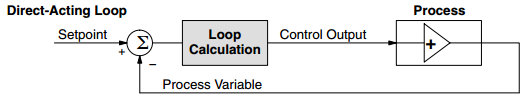

W3230-STM8s105c6 USER MANUAL 
=====================

© 2022 Emile

# Changelog

2022-11-17: Interface with ESP8266 webserver added 
2022-03-21:	First version of W3230 for STM8 

# Features

* Fahrenheit or Celsius display selectable with **CF** parameter
* PID-controller (for heating only) selectable with adjustable **Kc**, **Ti**, **Td** and **Ts** parameters
* PID-output signal (slow PWM, T=12.5 sec) present at **SSR output** for connection to a Solid-State Relay (SSR) to control heating
* Configurable Power heating, ideal for conical fermenters to limit the amount of heating power
* Second temperature probe functionality for measuring outside temperature. Used in thermostat control to prevent uneconomical heating/cooling cycles. 
  If the outside temperature is warm enough, heating is not engaged. Same for cooling, if the outside temperature is cool enough, cooling is not engaged.
* Up to 6 profiles with up to 10 setpoints and durations
* Each setpoint can be held for 1-999 hours (i.e. up to ~41 days) or 1-999 minutes (i.e. up to ~16 hours)
* Approximative ramping between setpoint temperatures
* Somewhat intuitive menus for configuring
* Separate delay settings for cooling and heating
* Configurable hysteresis (allowable temp swing) from 0.0 to 2.5 °C or 0.0 to 5.0 °F
* User definable alarm when temperature is out of or within range
* Easy displaying of setpoint, thermostat/profile-mode, actual temperature (default), 2nd temperature and PID-output (%)
* One-Wire temperature sensor added. This sensor controls a 3rd relay that can be used to switch a fan on/off
* ESP8266 interface for displaying of temperatures and states on smartphone

# Using the W3230-STM8 firmware

## Navigation and menus

By default the current temperature is displayed in °C or °F on the display, depending on the **CF** parameter. Pressing the 'SET' button enters the menu. Pressing button 'Up' and 'Down' scrolls through the menu items. 
Button 'SET' selects and 'Power' button steps back or cancels current selection.

The menu is divided in two steps. When first pressing 'SET', the following choices are presented:

|Menu item|Description|
|--------|-------|
|Pr0|Set parameters for profile 0|
|Pr1|Set parameters for profile 1|
|Pr2|Set parameters for profile 2|
|Pr3|Set parameters for profile 3|
|Pr4|Set parameters for profile 4|
|Pr5|Set parameters for profile 5|
|Par|Parameter settings menu|
*Table 2: Menu items*

Selecting one of the profiles enters the submenu for that profile.

Pr0-5 submenus have the following items:

|Sub menu item|Description|Values|
|--------|-------|-------|
|SP0|Set setpoint 0|-40.0 to 140͒°C or -40.0 to 250°F|
|dh0|Set duration 0|0 to 999 hours|
|...|Set setpoint/duration x|...|
|dh8|Set duration 8|0 to 999 hours|
|SP9|Set setpoint 9|-40.0 to 140°C or -40.0 to 250°F|
*Table 3: Profile sub-menu items*

You can change all the setpoints and durations associated with that profile from here. When running the programmed profile, *SP0* will be the initial setpoint, it will be held for *dh0* hours (unless ramping is used). 
After that *SP1* will be used as setpoint for dh1 hours. The profile will stop running when a duration (*dh*) of 0 hours OR last step is reached (consider *dh5* implicitly 0). When the profile has ended, W3230-STM8 will automatically switch to thermostat mode with the last reached setpoint (so I guess you could also consider a *dh* value of 0 as infinite hours).

The settings menu has the following items:

|Sub menu item|Description|Values|
|---|---|---|
|SP|Set setpoint|-40 to 140°C or -40 to 250°F|
|hy|Set hysteresis|0.0 to 5.0°C or 0.0 to 10.0°F|
|hy2|Set hysteresis for 2nd temp probe|0.0 to 25.0°C or 0.0 to 50.0°F|
|tc|Set temperature correction|-5.0 to 5.0°C or -10.0 to 10.0°F|
|tc2|Set temperature correction for 2nd temp probe|-5.0 to 5.0°C or -10.0 to 10.0°F|
|SA|Setpoint alarm|0 = off, -40 to 40°C or -80 to 80°F|
|cd|Set cooling delay|0 to 60 minutes|
|hd|Set heating delay|0 to 60 minutes|
|cF|Celsius or Fahrenheit display|0 = Celsius, 1 = Fahrenheit|
|Hc|Kc parameter for PID-controller in %/°C|-9999 to 9999|
|Ti|Ti parameter for PID-controller in seconds|0 to 9999|
|Td|Td parameter for PID-controller in seconds|0 to 9999|
|Ts|Ts parameter for PID-controller in seconds|0 to 9999|
|FAn|Fan control enable|0 = off, 1 = on|
|FLo|Hysteresis Lower-limit value for Fan control|-40 to 140 °C or -40 to 250°F|
|FHI|Hysteresis Upper-limit value for Fan control|-40 to 140 °C or -40 to 250°F|
|HPL|Heating Power Limit for SSR in Watts        | 0 to 9999 W|
|HPt|Power Rating for heating element in Watts   | 0 to 9999 W|

*Table 4: Settings sub-menu items*

**Setpoint**, well... The desired temperature to keep. The way W3230-STM8 firmware works, setpoint is *always* the value the thermostat or the PID-controller strives towards, even when running a profile. What the profile does is simply setting the setpoint at any given time.

**Hysteresis**: This parameter controls the allowable temperature range around the setpoint where the thermostat will not change state. For example, if temperature is greater than setpoint + hysteresis AND the time passed since last cooling cycle is greater than cooling delay, then cooling relay will be engaged. Once the temperature reaches setpoint again, cooling relay will be disengaged.

**Hysteresis 2**, temperature probe 2 should measure the environmental temperature. Now the allowable temperature range around the setpoint for temperature probe 2 is controlled. For example, if temperature 2 is less than **SP - hy2**, the cooling relay will remain off, even if temperature 1 is lower than **SP - hy**. Also, cooling will not be allowed again, until temperature 2 exceeds **SP - hy2** (that is, it has regained the hysteresis). 

**Temperature correction**, will be added to temperature sensor 1, this allows the user to calibrate the temperature reading. It is best to calibrate with a precision resistor of 10 k Ohms (1% tolerance). Replace the temperature sensor with such a resistor, let the W3230-STM8 run for at-least half an hour and adjust this parameter such that the temperature display is set to 25.0 °C.

**Temperature correction 2**, same as *temperature correction*, but for the second temperature probe.

**Setpoint alarm**, if setpoint alarm is greater than 0.0, then the alarm will sound once temperature differs from *SP* by more than *SA* degrees (this can be useful to warn against malfunctions, such as fridge door not closed or probe not attached to carboy). If *SA* is less than 0.0, then the alarm will sound if the temperature does **NOT** differ by more than (-) *SA* degrees (this could be used as an indication that wort has finally reached pitching temp). If *SA* is set to 0.0, the alarm will be disabled. If the alarm is tripped, then the buzzer will sound and the display will flash between temperature display and showing "SA", it will not however disengage the outputs and the unit will continue to work as normal. Please note, that care needs to be taken when running a profile (especially when not using ramping or with steep ramps) to allow for a sufficiently large margin, or the alarm could be tripped when setpoint changes.

**Cooling** and **heating delay** is the minimum 'off time' for each relay, to spare the compressor and relays from short cycling. If the the temperature is too high or too low, but the delay has not yet been met, the corresponding LED (heating/cooling) will blink, indicating that the controller is waiting to for the delay to pass before it will start heating or cooling. When the controller is powered on, the initial delay (for both heating and cooling) will **always** be approximately 1 minute, regardless of the settings. That is because even if your system could tolerate no heating or cooling delays during normal control (i.e. *cd* and/or *hd* set to zero), it would be undesirable for the relay to rapidly turn on and off in the event of a power outage causing mains power to fluctuate. Both cooling and heating delays are loaded when either cooling/heating relays switched off. So, for instance if you set cooling delay to 60 minutes and setpoint is reached, turning cooling relay off, it will be approximately one hour until cooling relay will be allowed to switch on again, even if you change your mind and change the setting in EEPROM (i.e. it will not affect the current cycle).

The delay can be used to prevent oscillation (hunting). For example, setting an appropriately long heating delay can prevent the heater coming on if the cooling cycle causes an undershoot that would otherwise cause heater to run. What is 'appropriate' depends on your setup.

**Celsius or Fahrenheit** can be used to set display mode for temperatures to Celsius or Fahrenheit. Note that the values stored in EEPROM are not directly changed with it, so if you change this, you need to make sure that the stored parameters are updated!

**Hc**, this is the proportional gain for the PID controller. The PID-controller only controls heating mode and this is in parallel with the thermostat mode (relays). So you have the choice of either controlling a heater with relays (on/off) or with a SSR.

**Ti**, this is the integral time-constant in seconds for the PID controller. See below for a more detailed explanation.

**Td**, this is the differential time-constant in seconds for the PID controller. See below for a more detailed explanation.

**Ts**, this is the sample-time in seconds for the PID controller. The PID-controller runs every **Ts** seconds. When set to 0, the PID-controller is disabled and normal thermostat (on-off) control is enabled. If you set this time too small, the pid-controller becomes too sensitive for changes in temperature. A decent value for temperature control is around 20-30 seconds (yes, that slow! It's temperature remember, doesn't change that quick). See below for a more detailed explanation.

**FAn**, set to 1 to control a compressor fan for a climate-chamber, or use it for any other switching application you like. This function is controlled by a One-Wire temperaturesensor (DS18B20) connected to the terminal-blocks and uses the third relay that is present.

**FLo**, the 3rd relay is switched off if the One-Wire temperaturesensor becomes lower than this value.

**FHi**, the 3rd relay is switched off if the One-Wire temperaturesensor becomes higher than this value.

**HPL**, the maximum power allowed for the electrical heating element. This is used to limit the PID-output, for example: HPL = 200 Watts and HPt = 500 Watts (the typical heating element in a Brewtools Conical Fermenter is 500 Watts). In this case, the PID-controller limits the output to 40 %, which corresponds to 200 Watts effectively.

**HPt**, the total power of the electrical heating element in Watts. Used by the PID-controller, together with **HPL**.

**Run mode**, selecting *Pr0* to *Pr5* will start the corresponding profile running from step 0, duration 0. Selecting *th* will switch to thermostat mode, the last setpoint from the previously running profile will be retained as the current setpoint when switching from a profile to thermostat mode.

## Thermostat control

With thermostat control, the setpoint *SP*, will not change and the controller will aim to keep the temperature to within the range of *SP* ± *hy*. Much like how the normal STC-1000 firmware works. The thermostat control runs once every second.

## PID-Control

When the **Ts** parameter is set to a value > 0, the PID-controller is enabled and works in parallel with the thermostat control. The PID-controller uses a sophisticated algorithm (a Takahashi Type C velocity algorithm) where the new output value is based upon the previous output value. The derivation of the algorithm for this controller is given in the .pdf document [PID Controller Calculus](./img/PID_Controller_Calculus.pdf).
The PID-controller is controlled with the *proportional gain*, *integral time-constant*, *differential time-constant* and the *Sample-Time*. They all work closely together. For more information on how to select optimum settings for a PID-controller, please refer to http://www.vandelogt.nl/uk_regelen_pid.php

The pid-output is a percentage between 0.0 and +100.0 %. It is in E-1 %, so a value of 123 actually means 12.3 %. This value can be seen by pressing the PWR button twice (one press shows the 2nd temperature probe, the 2nd press shows the pid-output percentage).  

The PID-controlled is set to a **direct-acting** process loop. This means that when the PID-output increases, the temperature (which is the process variable, or PV) also eventually increases. Of course, a true process is usually a complex transfer function that includes time delays. Here, we are only interested in the direction of change of the process variable in response to a PID-output change. Most process loops will be **direct-acting**, such as a temperature loop. An increase in the heat applied increases the temperature. Accordingly, direct-acting loops are sometimes called heating loops.

 
*A Direct-Acting process control loop*

**Source:** the above text and both images are copied from (and slightly adapted) from the DL05 Micro PLC User Manual, which has an excellent chapter (chapter 8) on PID-control.

The pid-output is available as a slow PWM signal (period-time is 12.5 seconds) on the terminal-bloacks, with the duty-cycle corresponding with the PID-output percentage.
For example: if the pid-output is equal to 200 (20.0 %), the output is low (0 V) for 2.5 seconds and high (+5 V) for 10 seconds. This repeats continuously until another pid-output percentage is calculated. 

## Running profiles

By entering the 'rn' submenu under settings and selecting a profile, the initial setpoint for that profile, *SP0*, is loaded into *SP*. Even when running a profile, *SP* will always be the value the controller aims to keep. The profile simple updates *SP* during its course.

From the instant the profile is started a timer will be running, and every time that timer indicates that one hour has passed, the current duration *dh*, will be incremented. If and only if, it has reached the current step duration, *dhx*, current duration will be reset to zero and the current step *St*, will be incremented and the next setpoint in the profile will be loaded into *SP*.  Note that all this only happens on one hour marks after the profile is started.

So, what will happen if the profile data is updated while the profile is running? Well, if that point has not been reached the data will be used. For example profile is running step 3 (with the first step being step 0). Then *SP3* has already been loaded into *SP*, so changing *SP0* - *SP3* will not have any effect on the current run. However, the duration *dh3* is still being evaluated every hour against the current duration, so changing it will have effect. 

Changing the setpoint, *SP*, when running a profile, will have immediate effect (as it is used by thermostat control), but it will be overwritten by profile when it reaches a new step.

Once the profile reaches the final setpoint, *SP9*, or a duration of zero hours, it will switch over to thermostat mode and maintain the last known setpoint indefinitely.

Finally, to stop a running profile, simply switch to thermostat mode.

## Ramping

The essence of ramping is to interpolate between the setpoints in a profile. This allows temperature changes to occur gradually instead of in steps.

Unfortunately, due to hardware limitations, true ramping (or true interpolation), is not feasible. So instead, an approximative approach is used.

Each step is divided into (at most) 64 substeps and on each substep, setpoint is updated by linear interpolation. The substeps only occur on one hour marks, so if the duration of the step is less than 64 hours, not all substeps will be used, if the duration is greater than 64 hours, setpoint will not be updated on every one hour mark, for example if duration is 192 hours (that is 8 days), setpoint will be updated every third hour).

Note, that in order to keep a constant temperature with ramping enabled, an extra setpoint with the same value will be needed (W3230-STM8 will attempt to ramp between all setpoints, but if the setpoints are the same, then the setpoint will remain constant during the step).

You can think of the ramping as being true, even if this approximation is being used, the only caveat is, if you need a long ramp (over several days or weeks) and require it to be smoother. Then you may need to split it over several steps.

Another tip would be to try to design your profiles with ramping in mind, if possible (that is include the extra setpoints when keeping constant temperature is desired), even if you will not use ramping. That way, the profiles will work as expected even if ramping is enabled.

## Using secondary temperature probe input

The idea is to use the secondary temperature probe to measure the outside or environmental temperature. This is especially economical for conical fermenters, because the actual temperature inside the fermenter will eventually converge to this environmental temperature. So if the outside temperature is low enough (lower than **SP - hy2**), the cooling relay will remain off.
Same is true for heating: if the outside temperature is high enough, heating is not energised, even when the actual temperature has not reached **SP - hy** yet. 

The correct value for **hy2** will be dependent of the specific setup (and also the *hy* value) and will typically be larger than the *hy* value.

It should also be noted, that it would be a very good idea to make sure the two temperature probes are calibrated (at least in respect to each other) around the setpoint. See also table 4.

## Additional features

**Sensor alarm**, if the measured temperature is out of range (indicating the sensor is not connected properly or broken), the internal buzzer will sound and display will show 'AL'. If secondary probe is enabled for thermostat control (**Pb2** = 1), then alarm will go off if that temperature goes out of range as well. On alarm, both relays will be disengaged and the heating and cooling delay will be reset to 1 minute. So, once the temperature in in range again (i.e. sensor is reconnected), temperature readings can stabilize before thermostat control takes over.

**Power off**, pressing and holding power button for a few seconds when the controller is not in menu (showing current temperature), will disable the relays (soft power off) and show 'OFF' on the display. To really power off, you need to cut mains power to the device. The soft power off state will remain after a power cycle. Long pressing the power off button again will bring it out of soft power off mode.

**Switch temperature display**, pressing and releasing the power button quickly will switch which temperature probe's value is being shown on the display. If temperature from the secondary probe is showing an additional LED (between the first two digits) will be lit as an indication.

By pressing and holding 'up' button when temperature is showing, the current firmware version number will be displayed. 

By pressing and holding 'down' button when temperature is showing, *th* will be displayed if the controller is in thermostat mode. If a profile is running, it will cycle through *Prx* (where *x* is the profile number), current profile step and current profile duration, to indicate which profile is running and the progress made.

By pressing and releasing the 'down' button, the controller cycles through the following temperature sensors:
* Temperature sensor 1 (the main sensor) is displayed in the upper display, the lower display will show the setpoint value. This is the default situation.
* Temperature sensor 2 is displayed in the upper display, then the lower display shows 't2'.
* One-wire temperature sensor: shows the temperature of the DS18B20 one-wire temperaturesensor. the lower display shows 'One'.
* PID-output as a percentage.

# UART / RS232 output

RXD and TXD pins are available for connection to a serial port. Note that all voltages are 3.3 V level and baudrate is 57600 Baud.
The following commands are available:
* sp: setpoint. type **sp** to show the actual value of the setpoint variable. If you type sp=120, setpoint is set to 12.0 °C.
* pid: pid-output, type **pid** to show the actual pid-output in E-1 %. Type **pid=250** to set pid-output to 25.0 %. Note that this overrules the pid-controller. You can reset this manual mode by typing **pid=-1**.
* rb: type **rb 0123** to read a byte from memory location 0x123.
* rw: type **rw 0123** to read a word from memory location 0x123.
* wb: type **wb 0123 ab** to write byte 0xab into memory location 0x123.
* ww: type **ww 0123 ab23** to write word 0xab23 into memory location 0x123.
* s0: type **s0** to display the W3230 revision number
* s1: type **s1** to display the results of a scan on the I2C-bus. The numbers displayed are the I2C addresses of actual devices found
* s2: type **s2** to display all running tasks with the actual and maximum duration
* s3: type **s3** to display the current value of the one-wire temperature sensor (a DS18B20), e.g. ds18b20_read(): 0, T= 23.5. The first number is the error-code (0 = no error), the second number the actual temperature read from the sensor.

At power-up, the following info is displayed:
* The current revision number
* ds2482_detect: 1. A 1 returned here indicates that the I2C to One-Wire device (a DS2482) was found.

# Development

W3230-STM8 is written in C and compiled using IAR STM8 embedded workbench v3.10.4.

## Useful tips for development

* You will need the STM8S105C6 reference-manual (the datasheet merely lists the hardware related issues).
* The IAR IDE organises the source-files in projects (.ewp) and workspaces (.eww). Use only 1 project per workspace. The default workspace file for W3230-STM8 is w3230_stm8s105.eww.
* A separate scheduler (non pre-emptive) has been added to address all timing issues. See the source files scheduler.c and scheduler.h
* Hardware routines (interrupts, ADC, eeprom) have all been rewritten from scratch, other routines have been copied and adapted from the stc1000p github repository.

# Other resources

Project home at [Github](https://github.com/Emile666/W3230_stm8s105/)

